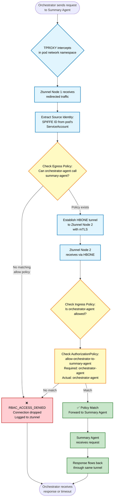
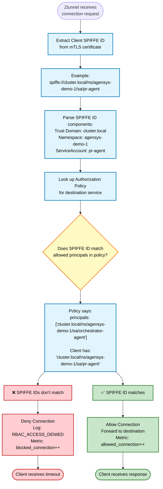
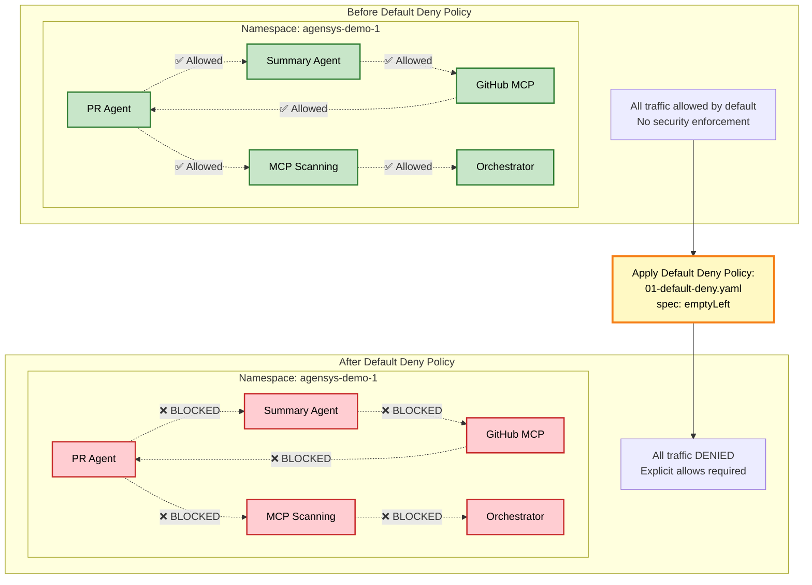
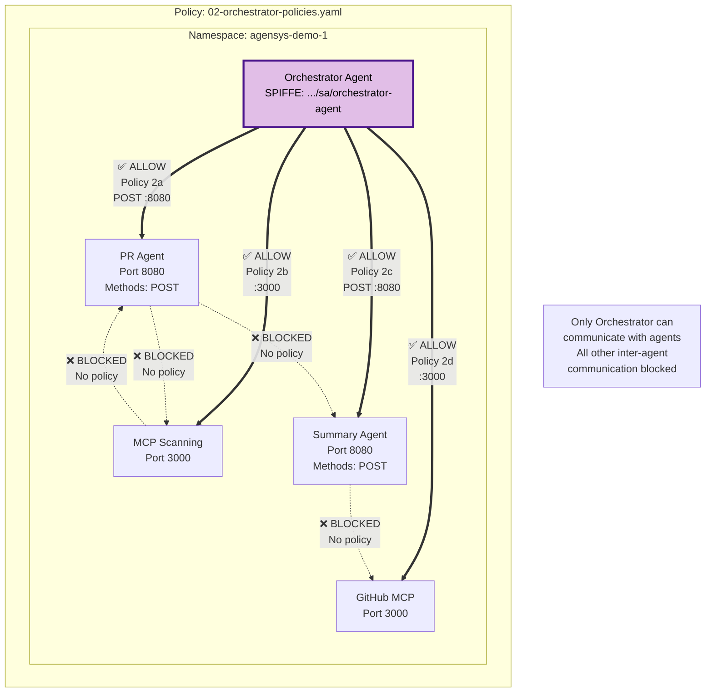

---
# Post title - will be auto-generated from filename if not changed
title: "Agents, MCP, and Kubernetes, Part 2"

# Publication date - automatically set to current date/time
date: 2025-12-22T10:00:00Z

# Author name - replace with your name
author: "Prashant Ramhit & Yevhen Khvastunov"

# slug:
slug: "agents-mcp-on-k8s-pt2"

# SEO and Social Media
keywords: 
  - kubernetes
  - MCP
  - Model Context Protocol
  - AI agents
  - agentic AI
  - k0s
  - k0rdent
  - microservices
  - autonomous systems
  - code review automation
  - Semgrep
  - GitHub automation
  - Ambient Mode
  - Istio

tags:
  - kubernetes
  - MCP
  - AI agents
  - automation
  - AIops

categories:
  - engineering
  - tutorials
  - AI/ML

# Set to false when ready to publish
draft: false

description: "Learn how to Secure AI agents and Model Context Protocol (MCP) servers on Kubernetes with Istio Ambient Mode. Part 2 of a three-part series exploring production-ready agentic architecture."

# Series information
series: ["Agents, MCP, Ambient Mode, and Kubernetes"]
series_weight: 1

# Related content suggestions
related: true

# Schema.org metadata for rich snippets
schema:
  type: "TechArticle"
  audience: "Developers, DevOps Engineers, Platform Engineers"
  proficiencyLevel: "Intermediate to Advanced"

mermaid: true

image: "images/agents-mcp-and-kubernetes/part-2.png"
---

## Introduction
Agents, MCP on Kubernetes, Part 2

Jensen Huang has mentioned [[LINK](https://africa.businessinsider.com/news/jensen-huang-says-he-wants-nvidia-to-be-a-company-with-100-million-ai-assistants/st3jsb5)] that NVIDIA has a target of 1 million agents in production for 50,000 employees, a ratio of 2000:1. This does not include MCP servers, data sources, or API endpoints. An incredibly ambitious target, it hints at a future of massive "agentic sprawl" in our enterprise systems. This kind of scope requires re-examining security and compliance. It also highlights and reinforces the need for strong "default deny" based security. The gold standard for default deny in networking is Zero Trust Networking Architectures (ZTNA).

In this second part of our series, we will examine how to deliver ZTNA for agents and MCP servers in Kubernetes clusters with a focus on Istio in Ambient Mode ("Istio ambient" from here on out) and L4 networking. In our follow on blog posting we will look more closely at how Istio ambient enables deeper integration with L7 proxies for application level security and policy enforcement.

## Istio in Ambient Mode

### A background on Istio in Ambient Mode

Istio is a service mesh that secures and controls communication between microservices on Kubernetes. It provides traffic management, zero-trust security (mTLS + workload identity), and deep observability, all without requiring changes to your application code.

Traditionally, Istio achieved this by injecting a sidecar proxy into every pod, which worked well but introduced operational and Resource Overhead and made Change Management difficult. This is what led to the creation of Istio Ambient Mode, a lighter, sidecar-less architecture.

To address the scaling, security, and operational challenges of traditional service-mesh models, the Istio community led by contributors from Google, IBM, Solo.io, and the wider open-source ecosystem designed Istio Ambient Mesh, a sidecar-less architecture announced in 2022-2023 and now a primary deployment mode.

Ambient Mode solves these issues by moving mesh responsibilities out of individual application pods and into the node and network layers. This creates a service mesh that is:

- Lighter, with no per-pod proxies
- More scalable, ideal for large fleets of small agents and MCP services
- Non-intrusive, enabling mesh upgrades without restarting applications
- More secure, due to a strict separation between application runtime and network enforcement

### Why ztunnel can be trusted

In Ambient, instead of injecting Envoy sidecars everywhere, each node runs ztunnel, a lightweight secure Layer-4 tunnel. Ztunnel has three important trust properties:

- Audit: Verifiable behavior through logs traces for:
  - SPIFFE [^1] identity validation
  - mTLS [^2] handshakes
  - Policy allow/deny decisions
  - Connection establishment and errors
- Tracing hooks (OpenTelemetry) for:
  - mTLS handshake spans
  - Connection forwarding latency
  - Node-to-node tunnel health
- Metrics (Prometheus) for:
  - handshake failures
  - dropped connections
  - active tunnels

All of this produces a full audit trail of how workloads authenticate and communicate, allowing applications to benefit from full zero-trust service-mesh capabilities without carrying any of the operational or performance burden themselves.

- Attack surface: Minimal exposure and isolation from applications
  - Runs at the node level, outside the pod so that apps cannot modify it.
  - Written in Rust, eliminating memory-corruption vulnerabilities.
  - No L7 parsing, it does not inspect HTTP, gRPC, or message payloads, removing entire classes of parsing-based exploits.
  - Few open interfaces:
    - Secure SPIFFE/mTLS for tunnels
    - A local control-plane socket
  - No dynamic logic, plugin system, or user-defined script execution.

Because ztunnel does so little at the application layer, very few attack vectors exist which dramatically lower than a full Envoy sidecar.

- Purpose: A single, Strictly-Scoped function; L4 + Encryption
  - Its responsibilities:
    - Enforce workload identity (SPIFFE/SPIRE).
    - Establish mTLS between workloads.
    - Traffic Interception via TPROXY [^3] and Provide L4-only forwarding (no routing, no header rewriting).
    - Send traffic to a waypoint proxy only when L7 policy is required.

## How Istio in Ambient Mode Works in Practice

After Ambient Mode is installed (see installation steps), the following are installed:

- **istiod** is deployed as the central control plane, responsible for:
  - Distributing configuration
  - Issuing and rotating workload certificates
  - Managing workload identities

- **ztunnel** is deployed as a DaemonSet, running one L4 proxy per node:
  - It replaces per-pod sidecar proxies
  - It handles transparent traffic interception, secure tunneling, and basic L4 enforcement

The following show all the core components and behaviors which are established:

```mermaid
graph TB
    subgraph "Kubernetes Cluster - Namespace: agensys-demo-1"
        subgraph "Control Plane - istio-system"
            ISTIOD[Istiod<br/>• xDS Configuration<br/>• Certificate Management<br/>• Identity Management]
            CA[Certificate Authority<br/>• Issues mTLS Certs<br/>• Node Boundary Validation<br/>• Auto-rotation]
        end
        
        subgraph "Node 1 - L4 Proxy"
            ZT1[Ztunnel DaemonSet<br/>• Traffic Interception via TPROXY<br/>• HBONE Client/Server<br/>• Certificate Pre-fetch]
            ORCH[Orchestrator Agent<br/>SPIFFE: .../sa/orchestrator-agent]
        end
        
        subgraph "Node 2 - L4 Proxy"
            ZT2[Ztunnel DaemonSet<br/>• Traffic Interception via TPROXY<br/>• HBONE Client/Server<br/>• Certificate Pre-fetch]
            MCPG[GitHub MCP Server<br/>SPIFFE: .../sa/github-mcp]
        end
    end
    
    subgraph "External Services"
        GH[GitHub Repository<br/>Pull Requests]
    end
    
    GH -->|Webhook Trigger| ORCH
    
    ORCH -.->|1. Request intercepted<br/>Wrapped in mTLS| ZT1
    ZT1 -.->|2. HBONE Tunnel<br/>HTTP/2 + mTLS| ZT2
    ZT2 -.->|3. Forward request<br/>Unwrapped from mTLS| MCPG
    
    MCPG -.->|4. GitHub API Call| GH
    
    GH -.->|5. PR Data| MCPG
    MCPG -.->|6. Response intercepted<br/>Wrapped in mTLS| ZT2
    ZT2 -.->|7. HBONE Tunnel<br/>HTTP/2 + mTLS| ZT1
    ZT1 -.->|8. Deliver response<br/>Unwrapped from mTLS| ORCH
    
    ISTIOD -.->|xDS Config<br/>Policies & Routes| ZT1
    ISTIOD -.->|xDS Config<br/>Policies & Routes| ZT2
    
    CA -.->|Issues x509 Cert<br/>with SPIFFE ID| ZT1
    CA -.->|Issues x509 Cert<br/>with SPIFFE ID| ZT2
    
    classDef controlPlane fill:#e1f5ff,stroke:#01579b,stroke-width:2px,color:#000
    classDef node1 fill:#ffebee,stroke:#c62828,stroke-width:3px,color:#000
    classDef node2 fill:#e3f2fd,stroke:#1565c0,stroke-width:3px,color:#000
    classDef agent fill:#f3e5f5,stroke:#4a148c,stroke-width:2px,color:#000
    classDef external fill:#e8f5e9,stroke:#1b5e20,stroke-width:2px,color:#000
    
    class ISTIOD,CA controlPlane
    class ZT1 node1
    class ZT2 node2
    class ORCH,MCPG agent
    class GH external
 ``` 
## Explanation

### 1. Control Plane (istio-system namespace):

- **istiod** - Central control plane responsible for:
  - Distributing configuration via xDS
  - Issuing and rotating workload certificates
  - Managing workload identities


- **Certificate Authority** - Integrated within istiod, enforces:
  - Node-boundary isolation
  - Kubernetes Service Account JWT validation
  - Node identity verification during certificate issuance

### 2. Data Plane:

- **ztunnel** - Deployed as a DaemonSet (one L4 proxy per node):
  - Replaces per-pod sidecar proxies
  - Handles transparent traffic interception
  - Manages secure HBONE tunneling
  - Enforces basic L4 policies
  - Pre-fetches certificates for all node workloads

```mermaid

flowchart LR
    %% NODE 1
    subgraph N1["Node 1"]
        direction TB
        ORC[Orchestrator Agent]
        Z1[ztunnel]
    end
    
    %% HBONE TUNNEL
    HBONE[HBONE Tunnel]
    
    %% NODE 2
    subgraph N2["Node 2"]
        direction TB
        GH[GitHub MCP Server]
        Z2[ztunnel]
    end
    
    %% TRAFFIC FLOW - REQUEST PATH
    ORC -->|1. Request| Z1
    Z1 -->|2. mTLS Encrypt| HBONE
    HBONE -->|3. Protected| Z2
    Z2 -->|4. Deliver| GH
    
    %% RETURN PATH (BOTTOM)
    GH -.->|5. Response| Z2
    Z2 -.->|6. Encrypted Return| HBONE
    HBONE -.->|7. Return to Node 1| Z1
    Z1 -.->|8. Send to Orchestrator| ORC

```

## How everything works

Workloads join the mesh by labeling the namespace: `istio.io/dataplane-mode=ambient`

### Immediate capabilities (no pod restart required):

  - Transparent traffic interception via TPROXY
  - Secure L4 connectivity with mTLS
  - SPIFFE-based workload identity
  - Full Layer 4 observability

### Traffic Redirection (L4)

### How it works:

  - ztunnel programs iptables rules into each pod's network namespace
  - Traffic redirected using PREROUTING and OUTPUT chains
  - TPROXY preserves original source/destination IP and port
  - Redirection happens at network namespace level (not inside containers)

### Benefits:

  - No sidecar containers
  - Lower CPU and memory overhead
  - Faster pod startup
  - Reduced operational complexity
  - Applications see unchanged socket semantics

### Automatic mTLS via HBONE
All in-mesh traffic is secured using HBONE (HTTP-Based Overlay Network Environment):

### Protocol Stack:

  - HTTP/2 CONNECT tunneling
  - Mutual TLS (mTLS) encryption
  - Layer 4 encapsulation

### How ztunnel handles HBONE:

  - Acts as both client and server
  - Establishes secure tunnels between node-local ztunnels
  - Encryption/decryption occurs in pod's network namespace
  - No sidecar proxy required

### Workload Identity (SPIFFE)

Each workload receives a cryptographic identity:

### Certificate Details:

  - X.509 certificate issued per workload
  - SPIFFE ID embedded in certificate SAN field
  - Format: spiffe://cluster.local/ns/<namespace>/sa/<service-account>

### Certificate Lifecycle:

  - Automatically rotated before expiry
  - Bound to Kubernetes Service Accounts
  - Pre-fetched by ztunnel for all node workloads

### Trust Model:

  - SPIFFE ID = authoritative identity for authentication
  - Used for policy enforcement and authorization
  - Workloads can only obtain authorized identities

### Current Capabilities (L4 Only): Enabled:

  - Transparent L4 traffic interception
  - Encrypted HBONE tunnels with mTLS
  - Strong SPIFFE-based workload identities
  - Full Layer 4 observability
  - Node-level policy enforcement

### Not Yet Enabled (requires waypoint proxy): Disabled:

  - L7 routing and traffic shaping
  - Advanced authorization policies
  - Request-level observability

## High Level Security ZTNA Policies

With this foundation in place, we now implement the critical access control layer. In a Zero-Trust architecture, we start with a fundamental principle: trust nothing, verify everything, and explicitly allow only what's necessary. Our default posture is DENY ALL, and we build explicit allow rules based on the principle of least privilege.

For our autonomous code review system \[ read here for PART 1 \], this means :

- Agents can only reach their designated LLM providers
- Agents can only access their required MCP servers
- MCP servers can only connect to their specific data sources
- All other traffic is blocked by default

### Policy Structure

- Each policy follows this pattern:
- Selector: Which workload this policy applies to (using SPIFFE identity)
- Action: ALLOW, DENY, or CUSTOM
- Rules: Specific conditions that must be met (source identity, destination, ports, etc.)

### The Complete Policy Set

Our code review system requires the following access patterns:

| Source | Destination | Action | Notes |
|--------|-------------|--------|-------|
| Orchestrator Agent | PR Agent | ALLOW | PR Review |
| Orchestrator Agent | MCP Code Scanning Server | ALLOW | Security scanning |
| Orchestrator Agent | Executive Summary Agent | ALLOW | Report generation |
| Orchestrator Agent | GitHub MCP Server | ALLOW | PR comment posting |
| PR Agent | OpenAI API | ALLOW | Code analysis via GPT-4 |
| Executive Summary Agent | Anthropic API | ALLOW | Summary via Claude |
| MCP Code Scanning Server | Semgrep Cloud | ALLOW | Vulnerability scanning |
| GitHub MCP Server | GitHub API | ALLOW | Repository access |
| ALL | ALL | DENY | Default deny everything else |

### Repository Structure

All policies are maintained in our GitHub repository: <https://github.com/Mirantis/agensys-codereview-demo/tree/policies/policies>
 \[ \*\* Note: to CHange to final one prior to merge\]

### Policy Files

```
policies/
├── 01-default-deny.yaml              # Baseline security - deny all traffic, Namespace Wide
├── 02-orchestrator-policies.yaml     # Allow Orchestrator to call agents/MCP servers, Internal communication
├── 03-pr-agent-policies.yaml         # Allow PR Agent to call OpenAI API, External LLM access
├── 04-summary-agent-policies.yaml    # Allow Summary Agent to call Anthropic API, External LLM access
├── 05-mcp-scanning-policies.yaml     # Allow MCP Scanning to call Semgrep Cloud, External tool access
├── 06-mcp-github-policies.yaml       # Allow GitHub MCP to call GitHub API, External API access
└── README.md                         # Policy documentation
```

### **Policy Implementation Deep Dive**

Let's examine each policy in detail, understanding both what it does and why it's necessary for our code review workflow.

### 1. Traffic Flow with Policy Enforcement

The following is a Comprehensive flowchart showing the complete journey of a request through the mesh, including all decision points where policies are evaluated.

Below is the flow of the Orchestrator communicating to the Summary Agent and the same is followed by all flows.



### What It Shows

- Entry Point: Orchestrator Application sends request to Summary-Agent
- Interception: TPROXY redirects traffic to ztunnel
- Identity Extraction: Source workload identified via SPIFFE ID
- Egress Policy Check: "Is this source allowed to call this destination?"
- HBONE Tunnel: If allowed, establish encrypted tunnel to destination node
- Ingress Policy Check: "Is this source authorized to access this destination?"
- Authorization Policy Evaluation: Match SPIFFE ID against policy principals
- Two Outcomes:
  - Allow Path: Forward to destination, response flows back
  - Deny Path: Drop connection, log denial, client times out

### 2. SPIFFE ID-Based Authorization workflow which each Policy follows

And is the Detailed flowchart showing how ztunnel extracts SPIFFE IDs from mTLS certificates and uses them to make authorization decisions.


### What It Shows

Authorization Decision Flow:

- Connection Arrives: Ztunnel receives incoming connection request
- Extract SPIFFE ID: Read from client's mTLS certificate SAN field
- Parse Components: Break down SPIFFE ID into parts
- Trust Domain: cluster.local
- Namespace: agensys-demo-1
- ServiceAccount: pr-agent
- Policy Lookup: Find AuthorizationPolicy for destination service
- Principal Matching: Compare SPIFFE ID against allowed principals
- Two Outcomes:
  - Match: Allow connection, forward traffic, increment metrics
  - No Match: Deny connection, log denial, drop packet, timeout

### 3. Global Default Deny Policy

Policy File: [01-default-deny.yaml](https://raw.githubusercontent.com/Mirantis/blog-material/main/autonomous-code-review/policies/01-default-deny.yaml)



**What it does:** This is the foundation of our Zero-Trust architecture. It creates a cluster-wide default-deny posture for all workloads in the mcp-deny-1 namespace where our agents run. Any traffic not explicitly allowed by subsequent policies will be blocked.

**How it works:**

- Selector: Applies to ALL workloads (empty selector = matches everything in namespace)
- Action: DENY
- Rules: No rules specified = deny everything
- Enforcement Point: ztunnel on the destination node (inbound traffic)

**Why we need it:** Without this policy, our mesh operates in "allow-all" mode. This policy inverts the security model - now we must explicitly allow each communication path. This prevents:

- Accidental connections between agents
- Lateral movement if an agent is compromised
- Data exfiltration to unauthorized endpoints
- Agents accessing MCP servers they shouldn't use

### 4. Orchestrator Agent Outbound Policies

Policy File: [02-orchestrator-policies.yaml](https://raw.githubusercontent.com/Mirantis/blog-material/main/autonomous-code-review/policies/02-orchestrator-policies.yaml)

images/agents-mcp-and-kubernetes/part-1/1.png



**What it does:** Grants the Orchestrator Agent permission to communicate with the four components it needs for workflow coordination: PR Agent, MCP Code Scanning Server, Executive Summary Agent, and GitHub MCP Server.

**How it works:** This policy is applied to each destination service (PR Agent, MCP Servers, Summary Agent). It allows inbound connections ONLY from the Orchestrator's SPIFFE identity.

**Why we need it:** The Orchestrator must dispatch code review tasks to the PR Agent. This policy ensures:

- Only the Orchestrator can trigger PR analysis (not other agents)
- Only the legitimate API port is accessible
- Only POST operations are allowed (no GET/DELETE/etc.)

The Orchestrator initiates security scans by calling the MCP Code Scanning Server. This policy prevents:

- Direct access to scanning server from other agents
- Bypass of workflow orchestration
- Unauthorized security scans

After collecting results from PR Agent and MCP Scanning, the Orchestrator sends them to the Summary Agent for consolidation. This policy ensures only the Orchestrator can request summaries.

The Orchestrator posts the final review to GitHub via the MCP Server. This ensures:

- Only completed workflows post to GitHub
- Individual agents cannot directly comment on PRs
- All GitHub interactions are auditable through the Orchestrator

### 5. PR Agent Outbound Policy

**Policy File:** [03-pr-agent-policies.yaml](https://raw.githubusercontent.com/Mirantis/blog-material/main/autonomous-code-review/policies/03-pr-agent-policies.yaml)

**What it does:** Allows the PR Agent to make outbound connections to the OpenAI API for GPT-4 inference. This is the ONLY external connection the PR Agent is permitted to make.

**How it works:** This uses a ServiceEntry to represent the external OpenAI API, combined with an AuthorizationPolicy that allows only the PR Agent to access it. The policy is enforced by ztunnel at the source node for egress traffic.

**Why we need it:** The PR Agent performs code analysis using GPT-4. This policy ensures:

- PR Agent cannot access other LLM providers (e.g., can't call Anthropic)
- PR Agent cannot access other external APIs
- PR Agent cannot make unauthorized outbound connections
- Cost control: only authorized LLM usage

**Security Note:** Even though OpenAI API requires an API key, this network policy provides defense-in-depth. If the API key is compromised, the attacker still cannot use it from other agents.

### 6. Executive Summary Agent Outbound Policy

**Policy File:** [04-summary-agent-policies.yaml](https://raw.githubusercontent.com/Mirantis/blog-material/main/autonomous-code-review/policies/04-summary-agent-policies.yaml)

**What it does:** Permits the Executive Summary Agent to communicate with the Anthropic API (Claude Sonnet-4) for generating executive summaries. This is the agent's sole external connection.

**How it works:** This uses a ServiceEntry for the external Anthropic API combined with an AuthorizationPolicy that restricts access to only the Summary Agent's SPIFFE identity. Enforcement occurs at the ztunnel on the source node.

**Why we need it:** Different LLMs have different strengths. We use Claude for executive summaries. This policy ensures:

- Summary Agent uses only Claude (architectural decision enforcement)
- No cross-contamination of LLM providers
- Cost tracking per agent (different billing)
- Summary Agent cannot access internal services directly

Architectural Note: We intentionally use different LLMs for different tasks (GPT-4 for code analysis, Claude for summaries). The network policies enforce this architectural decision at the infrastructure level.

### 7. MCP Code Scanning Server Outbound Policy

**Policy File:** [05-mcp-scanning-policies.yaml](https://raw.githubusercontent.com/Mirantis/blog-material/main/autonomous-code-review/policies/05-mcp-scanning-policies.yaml)

**What it does:** Authorizes the MCP Code Scanning Server to connect to Semgrep Cloud Platform for vulnerability detection. This MCP server acts as an adapter between our agents and the external Semgrep service.

**How it works:** A ServiceEntry defines Semgrep Cloud Platform as an external service, and an AuthorizationPolicy restricts access to only the MCP Code Scanning Server's SPIFFE identity.

**Why we need it:** MCP servers are adapters to external tools. This policy ensures:

- MCP scanning server cannot call other services (e.g., GitHub, LLMs)
- Clear separation of concerns (scanning ≠ code analysis ≠ summarization)
- If MCP server is compromised, blast radius is limited to Semgrep
- Audit trail: all Semgrep access comes from this MCP server

MCP Architecture Note: MCP servers are purpose-built adapters. Each one should access ONLY its designated tool. This policy enforces that architectural constraint.

### 7. GitHub MCP Server Outbound Policy

**Policy File:** [06-mcp-github-policies.yaml](https://raw.githubusercontent.com/Mirantis/blog-material/main/autonomous-code-review/policies/06-mcp-github-policies.yaml)

**What it does:** Grants the GitHub MCP Server permission to communicate with GitHub's API for posting PR comments. This is the single point of GitHub integration in our system.

**How it works:** A ServiceEntry makes GitHub API visible to the mesh, and an AuthorizationPolicy ensures only the GitHub MCP Server can access it using its SPIFFE identity.

**Why we need it:** GitHub access must be tightly controlled. This policy ensures:

- Only the GitHub MCP Server can post to PRs (not agents directly)
- All GitHub interactions flow through a single, auditable component
- If GitHub token is leaked, only this MCP server can use it
- Orchestration is enforced (agents can't bypass workflow)

Compliance Note: Many organizations require that all external API access be centralized and logged. This policy makes the GitHub MCP Server that single chokepoint.

## Summary: Zero-Trust Achieved

We've implemented a comprehensive Zero-Trust Network Architecture for our agentic AI system using Istio's authorization policies. Each component now has precisely defined access.

Our default-deny foundation inverts the traditional security model. Instead of allowing everything and blocking threats, we deny all traffic by default and explicitly permit only necessary communication paths. After policies, every connection is intentional, auditable, and enforceable through infrastructure rather than application code.

The encrypted foundation combined with these Zero-Trust policies creates production-ready agentic AI infrastructure. The rules are defined, the doors are locked, and only authorized communication flows through our system.

## Conclusion

Kubernetes has won as the de facto application delivery mechanism. Not just for cloud native, but also for AI-native going forward. Every major frontier model runs on Kubernetes. NVIDIA runs on Kubernetes. Agents and MCP servers will run on Kubernetes. Meanwhile, we will see massive agentic sprawl. Istio in Ambient Mode provides a unique capability to deliver a high quality ZTNA across your entire fleet of Kubernetes nodes running Agents and MCP servers. Policy can be enacted and enforced in a very granular manner. Most importantly, Istio ambient sets us up to also insert L7 application level security enforcement for MCP (or other protocols) along with observability. In the next couple of parts in this blog series we will go deep on L7 agent gateways and observability to help tie this entire picture together.

## Footnotes

[^1]:SPIFFE: [<https://spiffe.io/>] Secure Production Identity Framework For Everyone, Is an open-source standard for securely identifying software services in dynamic and heterogeneous environments. It provides a cryptographic identity to every workload in a modern production environment. SPIFFE is now graduated projects of the CNCF

[^2]:mTLS: [<https://en.wikipedia.org/wiki/Mutual_authentication>] Mutual Transport Layer Security (also called Mutual TLS or Two-Way TLS). It's a security protocol where both the client and server authenticate each other using digital certificates before establishing a connection.

[^3]:TPROXY: [<https://docs.kernel.org/networking/tproxy.html>]: Transparent Proxy is a Linux kernel feature that lets you intercept network traffic and redirect it to a user-space application (like a proxy) without changing the original source IP/port

## References:

<https://istio.io/latest/blog/2025/ambient-multicluster/?utm_source=chatgpt.com>

<https://aws.amazon.com/blogs/containers/transforming-istio-into-an-enterprise-ready-service-mesh-for-amazon-ecs/>

<https://istio.io/latest/blog/2022/ambient-security/>

<https://istio.io/latest/docs/ambient/architecture/data-plane/>
